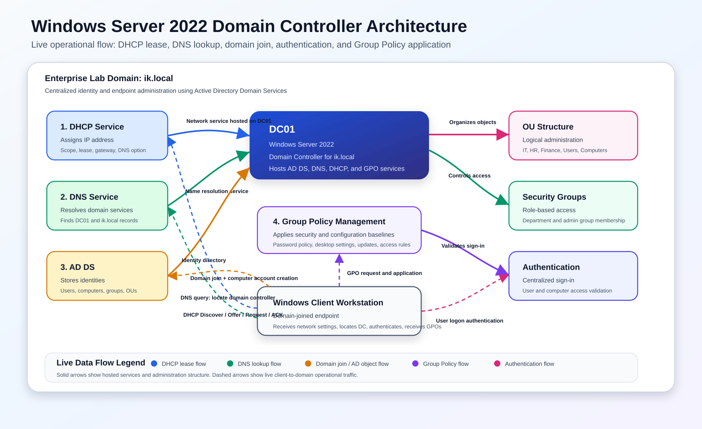

# Windows Server Infrastructure & Active Directory Administration

### Active Directory · DNS · DHCP · Group Policy · Domain-Joined Workstation

**Md Rahat Islam Anik · George Brown College · Cloud Computing Technologies (T465) · Postgraduate**

---

## Overview

This project covers the deployment and administration of a Windows Server enterprise environment built around centralized identity management, policy enforcement, and core infrastructure services.

The environment is structured as a single-domain Active Directory forest — the foundational architecture used in the majority of enterprise Windows networks. Every layer was configured and verified: domain promotion, organizational unit design, user and group management, Group Policy enforcement, DNS integration, DHCP scope management, and domain-joined workstation validation.

## Architecture Diagram

This architecture illustrates the Windows Server 2022 Active Directory environment, including Active Directory Domain Services (AD DS), DNS, DHCP, Organizational Units (OUs), Security Groups, Group Policy Objects (GPOs), and domain-joined client systems.

The diagram highlights the operational flow of IP assignment, DNS resolution, domain join operations, authentication, and Group Policy processing within the enterprise domain environment.

## Architecture Highlights

- Active Directory Domain Services (AD DS)
- DNS Integration
- DHCP Scope Management
- Organizational Unit (OU) Design
- Group Policy Enforcement
- Domain-Joined Workstation Authentication

- ## Environment Summary

| Component | Details |
|------------|----------|
| Domain | ik.local |
| Domain Controller | Windows Server 2022 |
| Services | AD DS, DNS, DHCP |
| Client | Windows Workstation |
| Management Tools | ADUC, GPMC, DNS Manager, DHCP Manager |

---

## What Was Built

### Active Directory Domain Services — Forest & Domain Deployment

A new Active Directory forest was deployed on Windows Server 2022, with the server promoted to Domain Controller. DNS was integrated at promotion, establishing the domain as the authoritative zone for name resolution across the environment.

The domain structure was built with a logical organizational unit hierarchy to support role-based administration — separating users, computers, and groups into discrete OUs that Group Policy can target independently.

### Active Directory Users & Computers — Identity Management

User accounts and security groups were created and organized within the OU structure using Active Directory Users & Computers (ADUC). Account attributes, group memberships, and organizational placement were configured to reflect a real enterprise identity model — not flat, ungrouped accounts, but a structured directory that scales.

### Group Policy — Centralized Configuration & Security Enforcement

Group Policy Objects (GPOs) were created and linked at the domain and OU level using the Group Policy Management Console (GPMC). Policy settings were applied to enforce security baselines and configuration standards across users and computers in the domain — the same mechanism enterprise IT teams use to push settings to thousands of endpoints simultaneously.

Policy application was verified using Group Policy results to confirm settings were correctly inherited and applied to the target objects.

### DNS — Domain Name Resolution

DNS was configured to support domain name resolution and service location across the environment. The DNS Server role operates as the authoritative resolver for the domain, enabling domain join, authentication, and replication to function correctly. Without properly configured DNS, Active Directory does not work — DNS is the backbone of every AD environment.

### DHCP — Automated IP Address Management

DHCP was configured with address scopes to automate IP assignment across the environment. Reservations were created to bind specific IP addresses to infrastructure servers by MAC address — ensuring consistent addressing for systems that need it while keeping the rest of the network dynamically managed.

Scope configuration, lease assignment, and reservation binding were all verified against connected client systems.

### Workstation Integration — Domain Join & Validation

A Windows client workstation was joined to the domain and authenticated under domain credentials. Domain membership, Group Policy application, and DNS resolution were all validated post-join — confirming the environment functions end to end, not just at the server layer.

---

## Tech Stack

| Category | Tools & Services |
|---|---|
| Server OS | Windows Server 2022 |
| Directory Services | Active Directory Domain Services (AD DS) |
| Identity Management | Active Directory Users & Computers (ADUC) |
| Policy Enforcement | Group Policy Management Console (GPMC) |
| Name Resolution | DNS Server |
| IP Management | DHCP Server |
| Client Systems | Domain-Joined Windows Workstation |

---

## Skills Demonstrated

`Active Directory Domain Services` · `AD Forest Deployment` · `Organizational Unit Design` · `User & Group Management` · `Group Policy Objects` · `DNS Configuration` · `DHCP Scopes & Reservations` · `Domain Join & Validation` · `RBAC` · `Windows Server 2022` · `GPMC` · `ADUC`

---

## Screenshots

Configuration evidence from the deployed environment — each screenshot documents a validated configuration stage.

### Server Manager — AD DS, DNS, DHCP Roles Installed

### Active Directory Users & Computers — OU Structure & Users

### Group Policy Management — GPO Configuration

### DHCP Manager — Scope & Reservation Configuration

### Domain-Joined Workstation — Client Authentication Verified

---

## Lessons Learned

- DNS is the foundational service that enables Active Directory authentication, service discovery, and domain operations.
- Group Policy provides centralized configuration management and scalable security enforcement across domain-joined systems.
- Thoughtful Organizational Unit (OU) design simplifies administration, delegation, and policy targeting.
- DHCP reservations help maintain consistent addressing for critical infrastructure components.
- End-to-end validation of domain join, authentication, DNS resolution, and Group Policy processing is essential when verifying an enterprise environment.

## Author

**Md Rahat Islam Anik**
Cloud Computing & Network Administration · George Brown College · May 2026

